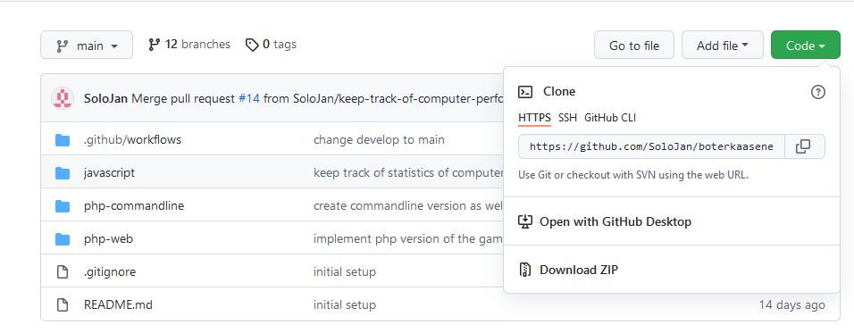
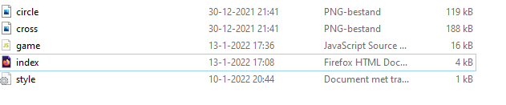

# Boter Kaas en Eieren
Dit is een voorbeeld om te laten zien hoe supervised learning werkt. Supervised learning is een techniek binnen 
artificial intelligence waarbij een computer getraind wordt aan de hand van bekende voorbeelden. Om die later in de 
praktijk toe te passen. De computer leert patronen te herkennen, maar leert nooit de regels van het spel.  

Dit is niet de beste manier om een computer boter kaas en eieren te laten spelen, het is ook niet de beste manier om de 
computer te trainen. Het is bedoeld om een aantal concepten duidelijk te maken, en als uitdaging, als je een manier weet
of bedenkt waardoor de computer sneller leert of helemaal onverslaanbaar download de code dan vooral en maak een eigen 
implementatie om te testen of je idee werkt.  

Als je het spelletje nog niet gespeeld heb doe dat dan eerst voor je verder leest op https://solojan.github.io/boterkaaseneieren/ 

Wil je meer weten over de ideeën hierachter kijk dan op https://en.wikipedia.org/wiki/Supervised_learning 

Hieronder volgt vooral een uitleg van hoe dit spelletje speelt en hoe je het kan aanpassen en manipuleren voor betere of andere resultaten. 

Rondom artificial intelligence hangt een zweem van magie en dit voorbeeld doorbreekt die magie een beetje. 
Wellicht ben je teleurgesteld dat de computer na honderd duizend keer trainen nog steeds fouten maakt die een mens al niet meer na 5 potjes maakt. 
Bedenk dan twee dingen de computer gaat nooit de regels snappen, maar herkent alleen patronen. Voor een mens is de ene zet heel dom, en de andere briljant, 
maar voor de computer is elke zet die die doet gewoon de beste uit een lijstje met voorgaande ervaringen.  Ten tweede 100.000 is voor een mens 
heel veel potjes, maar voor een computer niet zo veel, deze computer doet 100.000 spelletjes in 5 minuten, maar veel computers worden uren of jaren getraind.
De algoritmes achter google en facebook zijn gebaseerd op oneindig veel meer data dan jij in 5 minuten genereert. 

## Inhoudsopgave

1. [Zelf aan zet](##zelfaanzet)
    1. [Installatie voor dummies](#Installatievoordummies)
2. [Stappen plan, en manieren om het leren te manipuleren](#stappenplan)
    1. [Stap 1](#stap1)
    2. [Stap 2](#stap2)
    3. [Stap 3](#stap3)
    4. [Stap 4](#stap4)
    5. [Stap 5](#stap5)
    6. [Stap 6](#stap6)
    7. [Stap 7](#stap7)
3. [Keuze voor techniek](#techniek)

## Zelf aan zet 

Als je het leergedrag aanpast krijg je ook een ander eind resultaat. Als je de computer nu 20.000 keer traint zul je zien dat hij steeds vaker 
gelijk gaat spelen tegen zijn trainer, de computer speelt ook vaker gelijk dan dat die wint. In de folder javascript zit een file game.js 
op regel 241 zie je het volgende stukje code 

<pre>
 if(isDraw()){
      for (const [key, value] of Object.entries(movesInGame)) {
         updateMoves(key, value, 1)
      }
   }
</pre>

In dit stukje code wordt de computer beloont voor een gelijk spel. Haal het weg en speel nog eens 20.000 potjes.
Of maak de beloning voor gelijke spelen juist groter door de 1 in een 5 te veranderen en speel dan nog eens 20.000 potjes. 
Je zult zien dat het het gedrag van de computer verandert hij gaat juist meer of minder focussen op een gelijkspel

Wil je meer manieren weten om het gedrag te manipuleren lees dan vooral Stappen plan, en manieren om het leren te manipuleren
vooral stap 4, 5 en 6 zijn interessant als je het leergedrag wilt aanpassen. 

Als je weet hoe git werkt en je hebt eerder met javascript en html gewerkt kun je aan de slag, heb je geen idee wat git
of javascript is dan volgt hieronder nog een uitleg hoe je er mee aan de slag kan gaan. 

### Installatie voor dummies 

Als je naar de url https://github.com/SoloJan/boterkaaseneieren gaat kom je op een pagina waar de code staat. Je ziet een 
groene knop met daarop de tekst code, klik er op en kies voor Download Zip. Ben je bekend met git gebruik dan één 
van de andere opties. Als je de zip hebt unzip hem dan op een plek die logisch is bijvoorbeeld in je mijn documenten folder.   

In de folder vind je een subfolder met de naam javascript dat is de enige folder waar je iets in moet aanpassen. De inhoud van de folder ziet er zo uit

Klik op index.html die opent in een browser, bij mij is dat firefox maar het kan ook chrome of internet explorer zijn, je ziet het spelletje, 
maar dit keer is het, het spelletje wat op jou computer staat. Open nu game.js dat is de javascript code. Aanpassingen hier leiden tot 
een ander spel verloop. Als je nog nooit geprogrammeerd hebt kun je dit op windows het best openen met notepad wat standaard geïnstalleerd is. 
Er zijn vele alternatieven die beter zijn voor het schrijven van code dan notepad, ik heb zelf ervaring met InteliJ en Visual Code en Notepad++ is ook prettige en laagdrempelig.
Maar voor een enkele aanpassing is notepad op windows of TextEdit op Apple prima maar open het niet in word of een andere text verwerker. 

Je bent klaar om te gaan begin de code aan te passen en bedenk nieuwe strategieën succes. 

## Stappen plan, en manieren om het leren te manipuleren 

Hier volgt een uitleg hoe je zelf dit kan nabouwen, met steeds ook suggesties hoe je het beter kan maken of hoe je
het leergedrag van de computer zou kunnen veranderen. 

### Stap 1: It is all in the game 
Maak een spelletje boter kaas en eieren. Zorg dat je het speler tegen speler kan spelen, waarbij je omstebeurt een kruisje 
of rondje mag zetten in het speelveld en zorg ook voor een herstart mogelijkheid. 
Bij boter kaas en eieren heb je veel meer kans om te winnen als je start. Dus bij het tweede spelletje mag altijd degene beginnen die 
in het eerste potje als tweede starte. 

Dit is het meeste werk van de hele oefening. Je kan het ook overslaan omdat het niets met artificial intelligence te maken heeft, maar 
als je goed snapt hoe het spelletje werkt en is gemaakt in code, is het straks ook makkelijk begrijpen hoe de code werkt. 

Na deze stap was mijn code dit https://github.com/SoloJan/boterkaaseneieren/tree/implement-player-against-player

### Stap 2: Zorg dat je ook tegen de computer kan spelen c 

Maak het spel zo dat je ook tegen de computer kan spelen. Voor nu doet de computer altijd een willekeurige zet, dat kan 
dus ook een zet zijn waarbij hij bovenop een rondje of kruisje gaat staan wat er al stond. 

Na deze stap was mijn code dit https://github.com/SoloJan/boterkaaseneieren/tree/implement-computer-player-in-javascript 
waarbij je de php folders kunt negeren. 

### Stap 3: Sla de stappen op die de computer zet 

Een belangrijk onderdeel is dat de computer kan leren van voorgaande spel situaties, daarvoor moeten we een spelsituatie wel kunnen 
opslaan, en later herkennen. Ik kies ervoor om het bord op te slaan en de zet die de computer doet. Je zou ook andere keuzes 
kunnen maken bijvoorbeeld alleen de zetten van computer en speler opslaan, maar niet de status van het bord. 

Je zou ook iets slims kunnen doen waardoor de computer sneller leert. Bijvoorbeeld of je linksboven, rechtsboven, 
linksonder of rechtsonder begint maakt voor boter kaas en eieren niet uit, je zou het bord als het ware kunnen draaien en hetzelfde spelletje hebben. 
Je kan spel situaties dus ook opslaan waarbij een kruisje linksonder, rechtsonder, linksboven, en rechtsonder dezelfde spelsituatie is. In mijn code zijn
dat vier unieke spel situaties en moet de computer dus veel langer leren om alle situaties een keer mee gemaakt te hebben. 

Ik kies ervoor om het bord als volgt op te slaan, ik gebruik een o voor een rondje en een x voor een kruisje, en gebruik nummertjes voor hun posities op het bord, 
waarbij ik bij 0 begin met tellen (dat doen software ontwikkelaars nou eenmaal graag) en ik eerst de rij opschrijf en dan de column 00 is dan de 1ste rij, 
en de 1ste column en is bovenaan links, 22 rechtsonder en 11 het vakje in het midden 

o11x20o00x21

Is dan een bord met rondje in het midden, kruisje links onder, rondje rechtsboven, en een kruisje in de middelste column van de laatste rij. 

Zowel rondje als kruisje kunnen de volgende rondde in dit geval winnend door het vakje rechtsonder te kiezen. 

De stap sla ik op door alleen de rij en column op te schrijven, ik sla dit op in een json annotatie 

{"o11x20o00x21" : "22"} betekent  dat de computer zijn zet doet op rechtsonder, wat dus een winnende zet is gegeven het bord. 

Hieronder zie je een voorbeeld van alle zetten die de computer deed in een spelletje waar die speelde met kruisje en won. 

{
"o00": "11",
"o00x11o22": "21",
"o00o02x11x21o22": "01"
}

Dat klinkt heel ingewikkeld, maar is het niet mijn code na deze stap vind je hier https://github.com/SoloJan/boterkaaseneieren/tree/store-steps-of-computer  

Bedenk dat de computer nog niets leert, dit is alleen maar infrastructuur die later nodig is

### Stap 4: This is where the magic happens 

In deze stap gaan we aangeven wat goed en slecht gedrag is van de computer. Vergelijk het met het trainen van een hond, 
waarbij je goed gedrag beloont met een snoepje, en je bij slecht gedrag de hond bestraffend toespreekt. Als de link tussen oorzaak en gevolg makkelijk is is het makkelijk leren.
Als je een hond wil leren dat hij niet het huis in mag en op het erf moet wachten is dat makkelijk, maar wil je een hond leren dat hij in principe het huis in mag maar niet als hij in de modder heeft gerold dan is dat moeilijker.
Bij boter kaas en eieren is het makkelijk om te leren dat de computer altijd een rij moet afmaken als die de kans krijgt, 
maar het vergt meer training als je wilt dat de computer ook ontdekt dat sommige begin zetten beter zijn dan anderen.  
Je moet zelf goed nadenken over hoe je wilt dat je computer leert en welk gedrag je positief vind en welk gedrag niet, vind je een gelijk spel bijvoorbeeld goed omdat de computer niet verliest, 
of vind je het slecht omdat die niet wint. Ik hanteer de volgende regels

1) Als de computer verliest krijgen alle stappen die er toe leiden -1 punten
2) Als de computer gelijk speelt krijgen alle stappen die daar toe leiden 1 punt
3) Als de computer wint krijgen alle stappen die daar toe leiden 2 punten
4) Als de computer een illegale zet doet krijgt alleen die laatste stap -10 punten. 

Punten worden hier bij elkaar opgeteld, stel de computer begint altijd met een kruisje in het midden, hij wint het eerste potje,
verliest het tweede potje, speelt het derde potje gelijk en verliest het vierde potje door een illegale zet later in het spel.
Dan heeft het plaatsen van een kruisje in het midden als eerste zet 2 punten. Namelijk + 2 voor het gewonnen potje, -1 voor het verloren potje en plus 1 voor een gelijkspel. 
De illegale zet die later in het spel voorkomt wordt de eerste zet van het kruisje niet aangerekend.  

Denk na over welk gedrag jij wilt, als je alleen de laatste zet beoordeelt leert de computer sneller over beslissende zetten, maar zal die nooit iets leren over ideale begin posities. 
Als je een gelijk spel niet met punten beloond zal dat ertoe leiden dat de computer minder vaak gelijkspeelt. 

Na deze stap leert de computer al, maar past die het nog niet toe. Je vind de code op 

https://github.com/SoloJan/boterkaaseneieren/tree/give-scores-to-different-outcomes

### Stap 5: Lessen in de praktijk 

Het is nu zaak om de lessen in de praktijk te brengen. De computer weet nu wat slechtte en goede zetten zijn, maar hoe gaat die om met dat gedrag.
Ik hanteer de volgende regels

1) Als de computer in een nieuwe situatie komt probeert die een nieuwe zet
2) Als de computer een situatie herkent probeert die in principe de beste zet voor die situatie
3) Als alle vorige pogingen van de computer voor de situatie lijden tot verlies (negatieve score) dan probeert de computer een zet die hij nog niet gedaan heeft. 

Na deze stap kun je zelf tegen de computer spelen mijn code na deze stap vind je hier 
https://github.com/SoloJan/boterkaaseneieren/tree/use-the-scores-of-previous-games-to-determine-move 

### Stap 6: Trainen, Trainen, Trainen  

Het duurt best lang voordat de computer goed wordt, dus je wilt hem niet helemaal zelf trainen. Gelukkig kan dat ook automatisch. 
De trainings data heeft een groot effect op hoe de computer speelt dus deze stap is belangrijk. 

Van de eerste 100 potjes verliest de computer ongeveer 90 keer, na ongeveer 20.000 potjes is het andersom en verliest hij nog maar 10 op de 100 spelletjes. 
Maar als je zelf tegen de computer speelt zie je dat hij nog steeds vaak rare zetten doet. De computer wordt vooral goed tegen de trainer, maar omdat jij anders
speelt maakt de computer tegen jou nog fouten. Als je zelf 20.000 potjes tegen de computer speelt is de computer heel goed tegen jou. 

Mijn trainer speelt als volgt
1) Hij doet een willekeurige zet in één van de lege vakjes
2) Als hij het spelletje kan winnen doet hij dat
3) Als hij kan voorkomen dat zijn tegenstander de volgende beurt kan winnen doet hij dat

De trainer kent het spel dus wel en probeert actief te winnen. Als jij afwijkend gedrag laat zien komt de computer in onbekend terrein en maakt die fouten. 
Als jij een tactiek doet om de computer te laten winnen is de kans gek genoeg juist groot dat de computer verliest want die situatie kent hij niet. 
Als jij er voor kiest om de computer niet te blokkeren dan komt de computer in een situatie die hij nog nooit heeft meegemaakt. De kans is groot dat hij daarna 
een ongeldige zet doet. 

Je kunt ook spelen tegen een trainer die alleen willekeurige zetten doet, dan leert de computer meer situaties kennen, maar duurt het dus ook langer voordat die de beslissende setten leert kennen. 
Je kunt de computer overigens ook trainen tegen een ander zelf lerende computer ook als ze beide de regels niet kennen worden ze uiteindelijk goed in het spel. 

Een andere keus die je kunt maken is of de computer tijdens het trainen zijn resultaten van vorige trainingen al toepast. Als de computer tijdens het trainen vorige successen mee neemt is de kans groot 
dat hij steeds hetzelfde patroon zal volgen. Als hij eenmaal een strategie heeft zal die die perfectioneren, maar geen nieuwe strategieën proberen. 
Maar als je de computer geen gebruik laat maken van vorige resultaten dan gaat veel kostbare trainingstijd verloren aan potjes waar de computer verliest door een illegale zet.    
Ik probeer een middenweg, ik doe in principe willekeurige zetten om zo ook nieuwe strategieën te verkennen, maar vermijd wel illegale zetten.  

Ik train de computer door echte potjes te spelen, daar zit ook een nadeel aan, de computer oefent heel vaak de openingszet omdat die bij ieder spelletje hetzelfde is,
maar oefent maar heel weinig met de eind situaties want die zijn veel unieker, maar juist die eind zetten zijn belangrijk voor de computer om goed te oefenen. Je kan ook een training bedenken
waarbij hij alleen maar oefent met situaties waarbij die binnen een zet kan winnen of verliezen, dan leert die sneller die situaties te herkennen. 

Mijn code na deze stap vind je hier 

https://github.com/SoloJan/boterkaaseneieren/tree/implement-possibility-to-train-computer-by-itself

### Stap 7: Wrap up 

Na stap 6 heb ik nog wat logica toegevoegd voor het bijhouden van de scores, en heb ik de code nog wat geherstructureerd 
om meer duidelijkheid te geven, daarom staan stukken code soms op andere plekken dan eerst. 

## Keuze voor techniek 

Ik kies voor een javascript implementatie. Het voordeel van javascript is dat het draait in de browser. En omdat iedereen 
een browser heeft op zijn laptop en telefoon hoef je niets te downloaden om met de code aan de slag te gaan. Dus ook mensen 
die nog nooit gecode hebben kunnen aan de slag en zelf de code aanpassen zonder dat ze iets anders dan de code hoeven te downloaden.  
Een ander voordeel is dat het heel makkelijk visueel te maken is, je kunt het spelletje echt spelen. Nog een voordeel omdat het 
javascript is kan ik het gratis online zetten. De meeste artificial intelligence toepassingen maken hun techniek keuzes op heel 
andere gronden. Python is waarschijnlijk de meest gebruikte taal voor dit soort oplossingen, maar eigenlijk is alles beter dan 
javascript als je echt aan de slag wil. 

Ik gebruik bewust geen externe algoritmes, maar maak alles zelf. In het echt zijn heel veel algoritmes allang bedacht en gratis 
beschikbaar, als je dan een zelflerende computer wilt ontwikkelen gebruik je zo'n algoritme wat je aanpast naar jou specifieke situatie. 

Een belangrijke uitdaging bij het schrijven van code is hoe je zaken opdeelt. Over het algemeen zou je de code voor het trainen van de computer
en het spelen van het spel zelf niet in hetzelfde script stoppen. Dat bied veel voordelen als je veel code hebt, maar maakt het ook moeilijker te 
volgen voor beginnende programmeurs, daarom staat alles hier onder elkaar en is de scheiding slechts vanwege het commentaar wat ik schrijf. 
De code is gericht op een breed publiek daarom vermijd ik ook veel van wat ingewikkeldere annotaties en functies die javascript ook heeft. 

